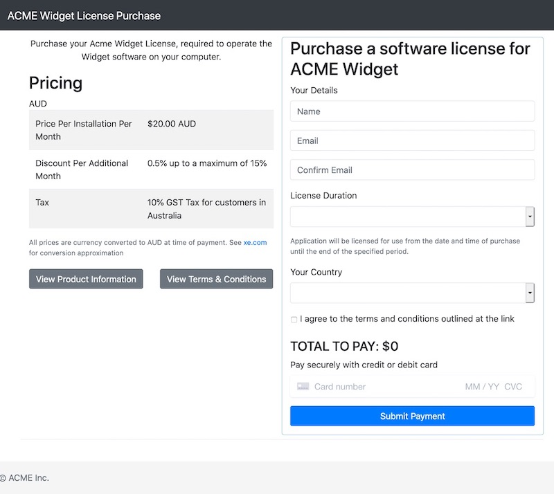

# blicense
## node-js-licensefile + express + stripe

---

### About

- This NodeJS/Express Application accepts payment for, and generates a node-js-licensefile compatible software license
- It provides a text download of the generated license with invoice details, stores the results in a database, and emails a copy to the customer
- It can apply discounts for each additional month the duration of the software license is for, encouraging users to invest in your product
- Optional single tax rate for sales in your region - For example, GST can be added for Australian buyers only if you are operating from Australia and must charge tax there
- It's great for selling licenses for electron apps using node-js-licensefile for validating licenses
- It's intended to be run behind a reverse-proxy which would add it's own HTTPS - and as such DOES NOT SUPPORT HTTPS
- You should really run this behind a HTTPS reverse proxy or add HTTPS support yourself, otherwise it won't be secure

### Screenshot
- 

### Requirements
- MySQL Server
- SMTP Email Host 
- Account and API keys with Stripe.com payments processor
- Server running NodeJS > 8 to host this code
- Reverse http proxy - Apache, Nginx etc.

### App Behaviour
- Startup
  - Database will automatically migrate, creating a licenses table
  - If the database cannot connect on start, it will retry indefinitely, logging each failure
- General
  - Logo will display if process.env.LOGO=true
  - Http Errors will be sanitized when process.env.NODE_ENV=production
- Route /
  - Displays main payment form
  - Will display process.env.DESCRIPTION under optional logo
  - process.env.PRODUCT_PAGE_LINK, process.env.TERMS_PAGE_LINK buttons appear below the pricing table
  - Tax will be added to total if the users country matches process.env.STRIPE_GST_COUNTRY
  - Pricing table populated from process.env. vars, tax/discount pricing table rows will be hidden if 0
  - Both validation and Stripe payment errors will appear above the Submit Payment button
  - Total is re-calculated on form value change
  - Discount will be automatically applied to total, discounting the total for each additional month added
  - Will reset the session on validation errors
  - Contains the stripe payment element
- Route /charge
  - The form action for the payment form, performs the charge and generates the license
  - Validates submitted data
  - If accessed via GET, will redirect to /
  - Redirects back to / on validation failure
  - Redirects to /completed on success
  - Creates stripe customer, charge
  - Creates license and invoice and saves in DB, emails to user
  - Doesn't halt on email send failure, but logs it so the user still gets their license in-browser
- Route /completed
  - Displays on payment completion and license generation success
  - Will redirect to / if no completion data present (ie. user has navigated directly to /completed)
  - Text from PROCESS.ENV.COMPLETED will appear under optional logo
  - On completion of transaction will display the invoice/license as it was emailed to the user, and a button to download a file copy
  - Resets the session

### Installation / Deployment Instructions
- Clone the blicense repo
- run npm install
- Copy the .env.example file to .env
  - Fill out the new .env file with your app settings
  - Stripe can be used with a restricted API key which only needs to be able to read Disputes, and Write to both Charges and Customers
  - Create ./views/static/logo.png, or set LOGO=false in your .env file
- Ensure directories ./logs ./sessions will be writable by the NodeJS process
- Set Up nodejs-license-file
  - Follow the instructions at https://www.npmjs.com/package/nodejs-license-file
  - The license template should be created at ./license_tamplate.txt rather than in-code - see ./license_template.txt.example
  - The private key created following the nodejs-license-file instructions should be stored at ./license_private_key.pem
  - Your licensed application will have to then parse and verify the generated license file itself using the public key as per the nodejs-license-file instructions
- Set up your application to run automatically
  - https://www.digitalocean.com/community/tutorials/how-to-set-up-a-node-js-application-for-production-on-ubuntu-18-04
- Set up your HTTPS proxy to secure the app and present it to the world
  - Apache https://www.digitalocean.com/community/tutorials/how-to-use-apache-http-server-as-reverse-proxy-using-mod_proxy-extension
  - Nginx https://www.digitalocean.com/community/tutorials/how-to-configure-nginx-with-ssl-as-a-reverse-proxy-for-jenkins

### Warranty
- No warranty expressed or implied. I assume no liaibility or responsibility for any damage this software causes. Use at your own risk.

### Future
- Free trial licenses, restricted by email
- Download link (unique?) on completion, mention on index that the download link and license will be provided post payment
- Product activation

### License
- https://creativecommons.org/licenses/by-sa/3.0/

### Author
- [bmorton.com](https://bmorton.com)